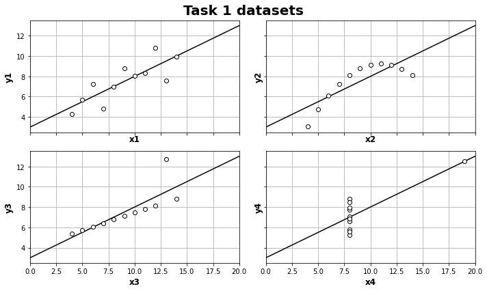
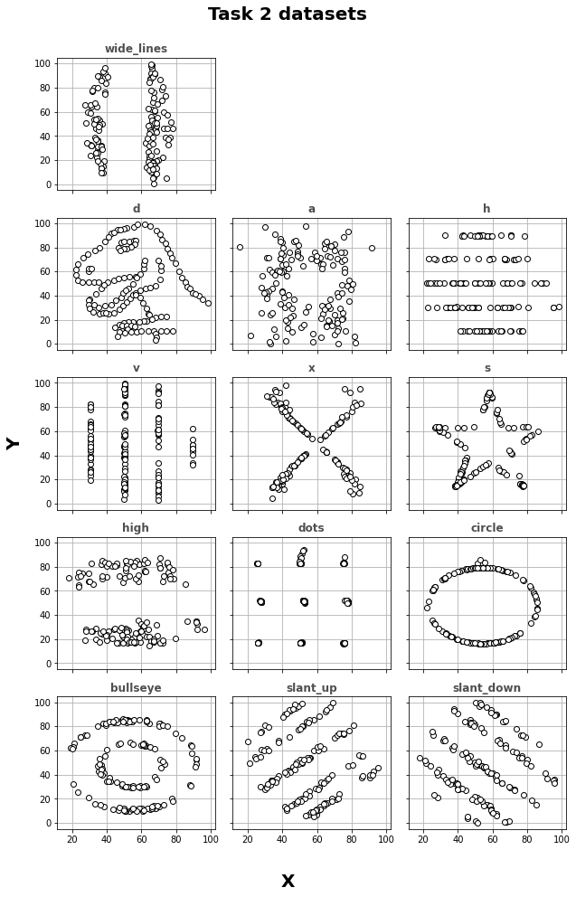

## Lab 6: The importance of the ploting

### Task 1) Analyze the dataset: [ans.csv](ans.csv)

Calculate the missing values (fill the tables).

| Property | Value | Accuracy |
| --- | --- | --- |
| Mean of x | ? | ? |
| Sample variance of x | ? | ? |
| Mean of y | ? | ? |
| Sample variance of y | ? | ? |
| Correlation between x and y | ? | ? |
| Linear regression line (y = a+bx)| ? | ? |
| Coefficient of determination of the linear regression| ? | ? |

### Task 2) Analyze the dataset: [ans2.tsv](ans2.tsv)

Calculate the missing values (fill the tables).

| Property | Value | Accuracy (up to 3 places)|
| --- | --- | --- |
| Mean of x | ? | ? |
| Mean of y | ? | ? |
| SD of x | ? | ? |
| SD of y | ? | ? |
| Corr | ? | ? |

### __Homework:__

Make the report in html (from jupyter) with the filled tables and scatter plots for:
- point 1, one single plot similar to the one from [Wikipedia](https://en.wikipedia.org/wiki/Anscombe%27s_quartet)
- point 2, in this case make separte subplots for each dataset (the plot in structure should look similar to the plots from Task5 in Lab5 

Can you guess what "d" and "s" stand for in given datasets of ans2.tsv?

The report should contain:
- the main report file in html (with all the plots embedded)
- the jupyter notebook*

** thus this time no *.py scripts as the python code should be included in jupyter/html
<hr>

<i>The homework should be sent until 24.04.2022 via <b>email</b> with 'DAV22_lab6_hw_Name_Surname.7z' (ASCII letters only) attachment.</i>


<i>Using non-English labels, legends, descriptions, etc. will be scored -10%</i>

<i>Additionally, all problems with the structure of the plot e.g. the plot size, labels font size, etc. will also affect the grading. You need to follow advice included in the lectures.</i>


__Epilog:__ Read the article [Same Stats, Different Graphs](https://www.autodeskresearch.com/publications/samestats) 

```python
# Task 1 read data
import pandas as pd
import numpy as np
from sklearn.metrics import r2_score
df = pd.read_csv('ans.csv', index_col=0)
```
```python
# Calculate statistics and print tables task 1
for i in range(1,5):
    x=df[f'x{i}']
    y=df[f'y{i}']
    print(f'## Set: x{i}, y{i}  \n')    
    print('| Property | Value | Accuracy (up to 3 places)|  ')
    print('| --- | --- | --- |  ') 
    print(f"| Mean of x | {round(x.mean(),3)} | 0.001 |  ")
    print(f"| Sample variance of x | {round(x.var(),3)} | 0.001 |  ")
    print(f"| Mean of y | {round(y.mean(),3)} | 0.001 |  ")
    print(f"| Sample variance of y | {round(y.var(),3)} | 0.001 |  ")
    print(f"| Correlation between x and y | {round(df.corr(method='pearson')[f'x{i}'][f'y{i}'],3)} | 0.001 |  ")
    a,b = np.polyfit(x,y,1)
    print(f'| Linear regression line (y = a+bx)| y={round(a,3)}x+{round(b,3)} | 0.001 |  ')
    x_list = x.tolist()
    print(f'| Coefficient of determination of the linear regression | {round(r2_score(y.tolist(),[a*i+b for i in x_list]),3)} | 0.001 |  \n')
```
## Set: x1, y1  

| Property | Value | Accuracy (up to 3 places)|  
| --- | --- | --- |  
| Mean of x | 9.0 | 0.001 |  
| Sample variance of x | 11.0 | 0.001 |  
| Mean of y | 7.501 | 0.001 |  
| Sample variance of y | 4.127 | 0.001 |  
| Correlation between x and y | 0.816 | 0.001 |  
| Linear regression line (y = a+bx)| y=0.5x+3.0 | 0.001 |  
| Coefficient of determination of the linear regression | 0.667 | 0.001 |  

## Set: x2, y2  

| Property | Value | Accuracy (up to 3 places)|  
| --- | --- | --- |  
| Mean of x | 9.0 | 0.001 |  
| Sample variance of x | 11.0 | 0.001 |  
| Mean of y | 7.501 | 0.001 |  
| Sample variance of y | 4.128 | 0.001 |  
| Correlation between x and y | 0.816 | 0.001 |  
| Linear regression line (y = a+bx)| y=0.5x+3.001 | 0.001 |  
| Coefficient of determination of the linear regression | 0.666 | 0.001 |  

## Set: x3, y3  

| Property | Value | Accuracy (up to 3 places)|  
| --- | --- | --- |  
| Mean of x | 9.0 | 0.001 |  
| Sample variance of x | 11.0 | 0.001 |  
| Mean of y | 7.5 | 0.001 |  
| Sample variance of y | 4.123 | 0.001 |  
| Correlation between x and y | 0.816 | 0.001 |  
| Linear regression line (y = a+bx)| y=0.5x+3.002 | 0.001 |  
| Coefficient of determination of the linear regression | 0.666 | 0.001 |  

## Set: x4, y4  

| Property | Value | Accuracy (up to 3 places)|  
| --- | --- | --- |  
| Mean of x | 9.0 | 0.001 |  
| Sample variance of x | 11.0 | 0.001 |  
| Mean of y | 7.501 | 0.001 |  
| Sample variance of y | 4.123 | 0.001 |  
| Correlation between x and y | 0.817 | 0.001 |  
| Linear regression line (y = a+bx)| y=0.5x+3.002 | 0.001 |  
| Coefficient of determination of the linear regression | 0.667 | 0.001 |  

```python
# Task 2 read data
df2 = pd.read_csv('ans2.tsv', sep='\t')
datasets = df2['dataset'].unique().tolist()
```
```python
# Calculate statistics and print tables task 2
for dset in datasets:
    dataset_df = df2.loc[(df2['dataset']==dset)]
    print(f'## Dataset: {dset}  \n')
    print('| Property | Value | Accuracy (up to 3 places)|  ')
    print('| --- | --- | --- |  ')
    print(f"| Mean of x | {round(df2['x'].mean(),3)} | 0.001 |  ")
    print(f"| Mean of y | {round(df2['y'].mean(),3)} | 0.001 |  ")
    print(f"| SD of x | {round(df2['x'].std(),3)} | 0.001 |  ")
    print(f"| SD of y | {round(df2['y'].std(),3)} | 0.001 |  ")
    print(f"| Corr | {round(df2.corr(method='pearson')['x']['y'],3)} | 0.001 |  \n")
```
## Dataset: d  

| Property | Value | Accuracy (up to 3 places)|  
| --- | --- | --- |  
| Mean of x | 54.266 | 0.001 |  
| Mean of y | 47.835 | 0.001 |  
| SD of x | 16.713 | 0.001 |  
| SD of y | 26.848 | 0.001 |  
| Corr | -0.066 | 0.001 |  

## Dataset: a  

| Property | Value | Accuracy (up to 3 places)|  
| --- | --- | --- |  
| Mean of x | 54.266 | 0.001 |  
| Mean of y | 47.835 | 0.001 |  
| SD of x | 16.713 | 0.001 |  
| SD of y | 26.848 | 0.001 |  
| Corr | -0.066 | 0.001 |  

## Dataset: h  

| Property | Value | Accuracy (up to 3 places)|  
| --- | --- | --- |  
| Mean of x | 54.266 | 0.001 |  
| Mean of y | 47.835 | 0.001 |  
| SD of x | 16.713 | 0.001 |  
| SD of y | 26.848 | 0.001 |  
| Corr | -0.066 | 0.001 |  

## Dataset: v  

| Property | Value | Accuracy (up to 3 places)|  
| --- | --- | --- |  
| Mean of x | 54.266 | 0.001 |  
| Mean of y | 47.835 | 0.001 |  
| SD of x | 16.713 | 0.001 |  
| SD of y | 26.848 | 0.001 |  
| Corr | -0.066 | 0.001 |  

## Dataset: x  

| Property | Value | Accuracy (up to 3 places)|  
| --- | --- | --- |  
| Mean of x | 54.266 | 0.001 |  
| Mean of y | 47.835 | 0.001 |  
| SD of x | 16.713 | 0.001 |  
| SD of y | 26.848 | 0.001 |  
| Corr | -0.066 | 0.001 |  

## Dataset: s  

| Property | Value | Accuracy (up to 3 places)|  
| --- | --- | --- |  
| Mean of x | 54.266 | 0.001 |  
| Mean of y | 47.835 | 0.001 |  
| SD of x | 16.713 | 0.001 |  
| SD of y | 26.848 | 0.001 |  
| Corr | -0.066 | 0.001 |  

## Dataset: high  

| Property | Value | Accuracy (up to 3 places)|  
| --- | --- | --- |  
| Mean of x | 54.266 | 0.001 |  
| Mean of y | 47.835 | 0.001 |  
| SD of x | 16.713 | 0.001 |  
| SD of y | 26.848 | 0.001 |  
| Corr | -0.066 | 0.001 |  

## Dataset: dots  

| Property | Value | Accuracy (up to 3 places)|  
| --- | --- | --- |  
| Mean of x | 54.266 | 0.001 |  
| Mean of y | 47.835 | 0.001 |  
| SD of x | 16.713 | 0.001 |  
| SD of y | 26.848 | 0.001 |  
| Corr | -0.066 | 0.001 |  

## Dataset: circle  

| Property | Value | Accuracy (up to 3 places)|  
| --- | --- | --- |  
| Mean of x | 54.266 | 0.001 |  
| Mean of y | 47.835 | 0.001 |  
| SD of x | 16.713 | 0.001 |  
| SD of y | 26.848 | 0.001 |  
| Corr | -0.066 | 0.001 |  

## Dataset: bullseye  

| Property | Value | Accuracy (up to 3 places)|  
| --- | --- | --- |  
| Mean of x | 54.266 | 0.001 |  
| Mean of y | 47.835 | 0.001 |  
| SD of x | 16.713 | 0.001 |  
| SD of y | 26.848 | 0.001 |  
| Corr | -0.066 | 0.001 |  

## Dataset: slant_up  

| Property | Value | Accuracy (up to 3 places)|  
| --- | --- | --- |  
| Mean of x | 54.266 | 0.001 |  
| Mean of y | 47.835 | 0.001 |  
| SD of x | 16.713 | 0.001 |  
| SD of y | 26.848 | 0.001 |  
| Corr | -0.066 | 0.001 |  

## Dataset: slant_down  

| Property | Value | Accuracy (up to 3 places)|  
| --- | --- | --- |  
| Mean of x | 54.266 | 0.001 |  
| Mean of y | 47.835 | 0.001 |  
| SD of x | 16.713 | 0.001 |  
| SD of y | 26.848 | 0.001 |  
| Corr | -0.066 | 0.001 |  

## Dataset: wide_lines  

| Property | Value | Accuracy (up to 3 places)|  
| --- | --- | --- |  
| Mean of x | 54.266 | 0.001 |  
| Mean of y | 47.835 | 0.001 |  
| SD of x | 16.713 | 0.001 |  
| SD of y | 26.848 | 0.001 |  
| Corr | -0.066 | 0.001 |  

```python
# Plot point 1
from matplotlib import pyplot as plt 
fig, axs = plt.subplots(2,2,figsize=(10,6),sharex=True,sharey=True)
for i in range(2):
    for j in range(2):
        index = i*2 + j + 1
        ax = axs[i,j]
        ax.grid(zorder=1)
        ax.set_xlim([0,20])
        ax.plot((0,20),(3,13),zorder=2, color='black')
        ax.scatter(df[f'x{index}'],df[f'y{index}'], zorder=3, facecolor='white', edgecolor='black')
        ax.set_xlabel(f'x{index}', fontweight='bold', fontsize=12)
        ax.set_ylabel(f'y{index}', fontweight='bold', fontsize=12)
plt.tight_layout(rect=(0,0,1,0.95))
fig.suptitle('Task 1 datasets',fontsize=20,fontweight='bold')
plt.show()
```
  

```python
# Plot point 2
fig, axs = plt.subplots(5,3,figsize=(9,14),sharex=True,sharey=True)
for i in range(1,5):
    for j in range(3):
        index = (i-1)*3 + j
        ax = axs[i,j]
        ax.grid(zorder=1)
        dataset_df = df2.loc[(df2['dataset']==datasets[index])]
        x = dataset_df['x']
        y = dataset_df['y']
        ax.scatter(x,y, zorder=3, facecolor='white', edgecolor='black')
        ax.set_title(datasets[index], fontweight='bold', fontsize=12,color='#4f4f4f')
# add 13 dataset
ax=axs[0,0]
ax.grid(zorder=1)
dataset_df = df2.loc[(df2['dataset']==datasets[12])]
x = dataset_df['x']
y = dataset_df['y']
ax.scatter(x,y, zorder=3, facecolor='white', edgecolor='black')
ax.set_title(datasets[12], fontweight='bold', fontsize=12,color='#4f4f4f')
axs[0,1].remove()
axs[0,2].remove()
##
plt.tight_layout(rect=(0.05,0.05,1,0.95))
fig.suptitle('Task 2 datasets',fontsize=20,fontweight='bold')
fig.supxlabel('X',fontsize=20,fontweight='bold')
fig.supylabel('Y',fontsize=20,fontweight='bold')
plt.show()
```
  

